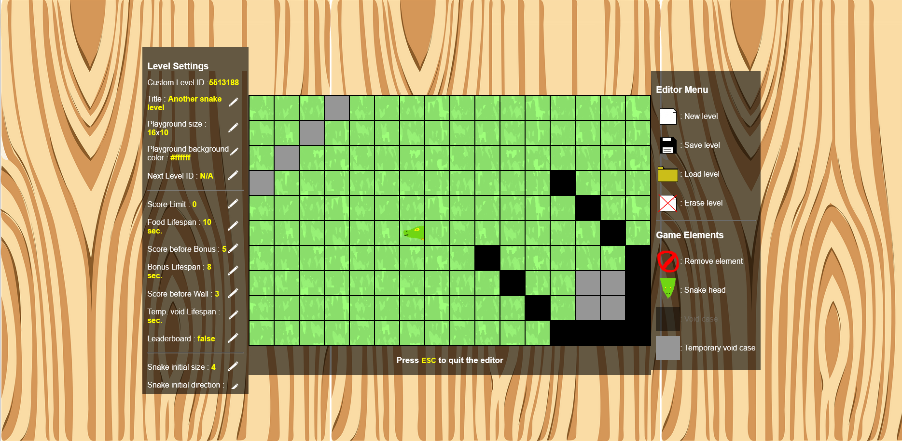

# Snake Game

## Description

The aim of the project is to create a snake game.
This is an improvement of the snake game created for a C project done during my studies.
The project uses HTML, CSS, Javascript.

It's a personal project done during the year 2024.

## Requirement

 - A computer
 - A browser

## Installation 

1) Download the zip of this repo
2) Extract the zip wherever you want
3) Open the extracted folder
4) Open the file `snake.html` with your browser

## Features

- Customizable controls
- Create your custom snake levels with the Snake Editor
- Import & export custom snake levels created from the editor
- Offline leaderboards

## Screenshots

